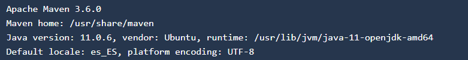
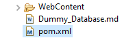
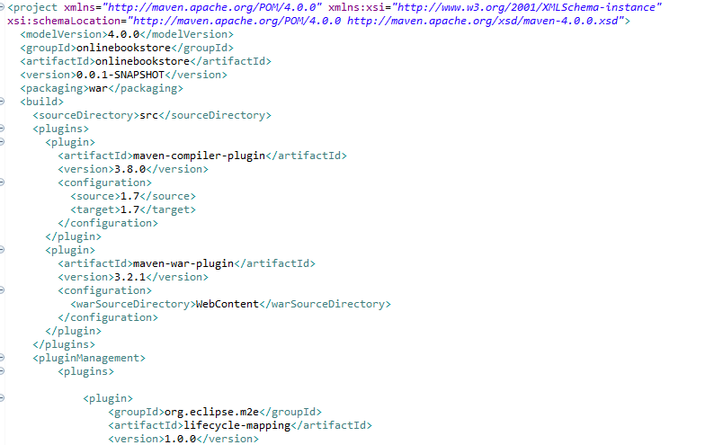
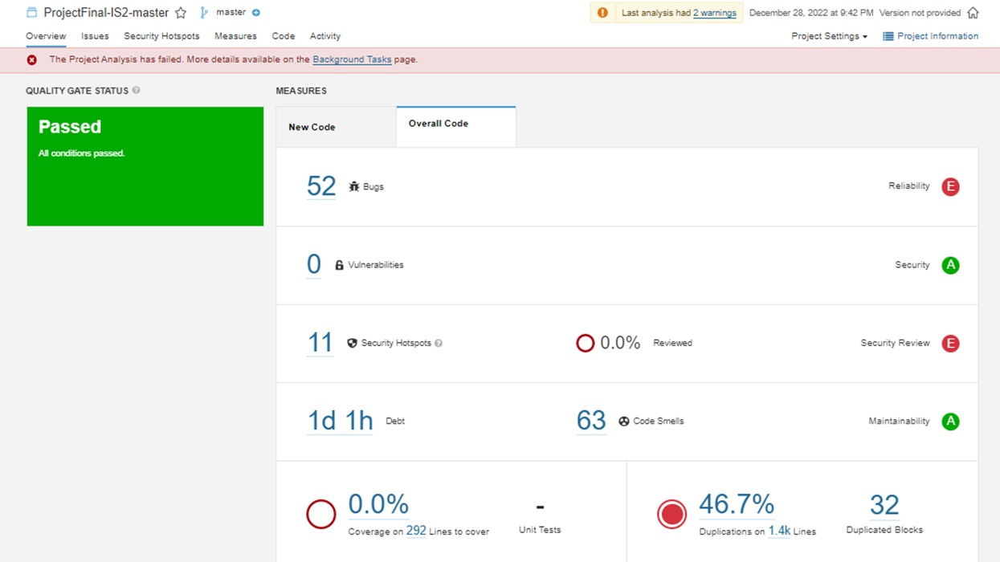
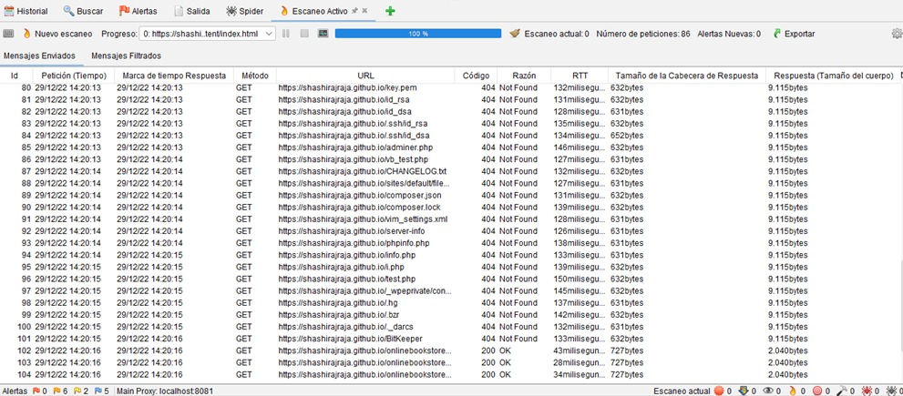
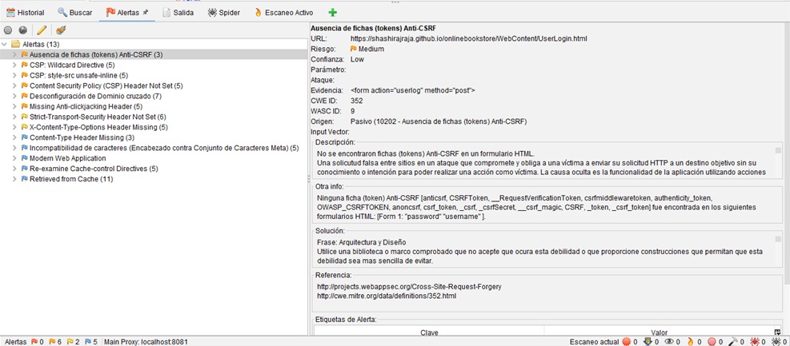
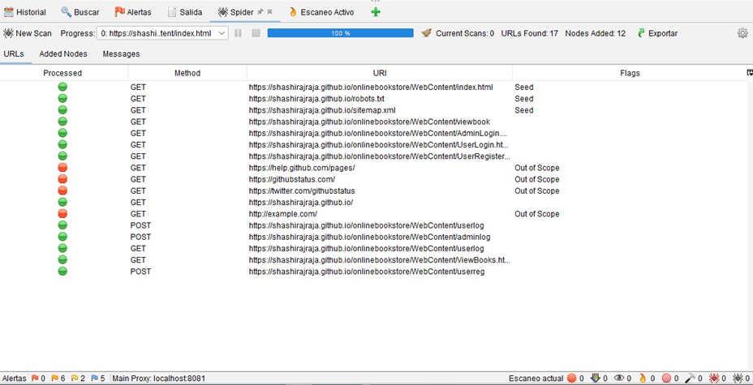
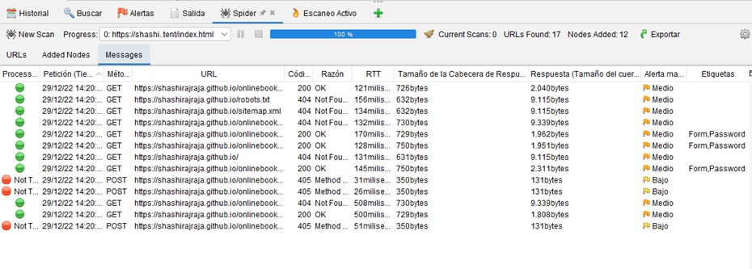

# Integración Continua/Despliegue Continuo (CI/CD)
## Pipeline:
    pipeline {
        agent any
        
        tools {
            node.js "node"
        }

        stages {
            stage('Copy Repository') {
                steps {
                    // Get some code from a GitHub repository
                    git 'https://github.com/Katy-Bejar/ProjectFinal-IS2/tree/master.git'
                }
            }

            stage('Install dependency') {
                steps {
                    bat 'npm install'
                }
            }

            stage('Analisis estatico') {
                  steps {
                      echo 'SonarQube'
                      withSonarQubeEnv('SonarQube') {
                          bat "C:\sonar-scanner-4.7.0.2747-windows\bin\sonar-scanner.bat"
                      }
                  }
            }

            stage('Prueba Unitaria') {
                steps {
                    bat 'npm test'
                }
            }

            stage('build') {
                steps {
                    bat 'npm install'
                }
            }
        }
    }

## Construcción Automática:
Para la construcción automática del proyecto usamos Maven:

Instalación:

sudo apt install maven

mvn -version

Archivo pom.xml

## Análisis Estático: 
Para el análisis estático del código fuente se usó la herramienta de software SonarQube y su aditivo SonarQube Scanner.

    stage('Análisis estático') {
      steps {
          echo 'SonarQube...'
          withSonarQubeEnv('SonarQube') {
              bat "C:\sonar-scanner-4.7.0.2747-windows\bin\sonar-scanner.bat"
          }
      }
    }
    
    

## Pruebas Unitarias:

## Pruebas Funcionales:
Se realizaron test funcionales con la herramienta de Selenium para la validación del email Id, para lo cual se realizaron los siguientes tests.

    def test1(self): 
        email = "ebejarr@unsa.edu.pe"
        esperado = check(email)
        print("TEST 1: ", email)
        self.assertEqual(WebTester(email), esperado)
    def test2(self): 
        email = "ggdeebor@gmailcom"
        esperado = check(email)
        print("TEST 2: ", email)
        self.assertEqual(WebTester(email), esperado)
    def test3(self): 
        email = "ikikop@gmai.com"
        esperado = check(email)
        print("TEST 3: ", email)
        self.assertEqual(WebTester(email), esperado)
    def test4(self): 
        email = "@datagmail.com"
        esperado = check(email)
        print("TEST 4: ", email)
        self.assertEqual(WebTester(email), esperado)

## Pruebas de Seguridad:
Se realizaron las pruebas de seguridad usando OWASP ZAP y estos fueron los resultados obtenidos:

#### Escaneo Activo

#### Alertas

#### Spider (URLs)

#### Spider (Messages)

## Pruebas de Performance:

